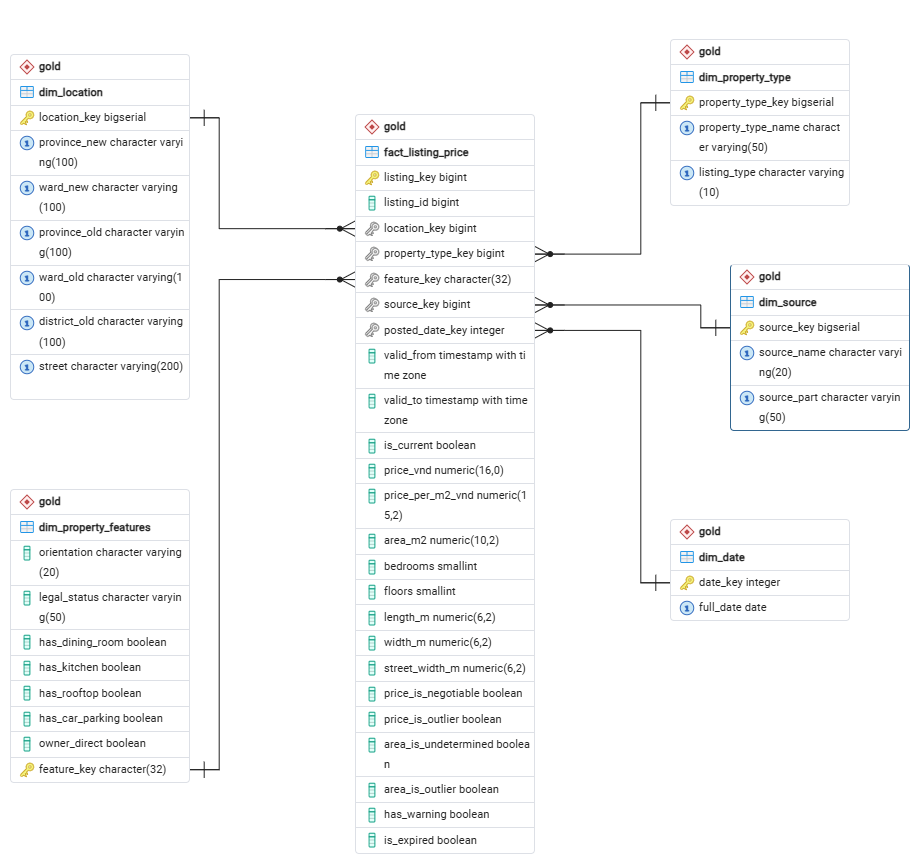
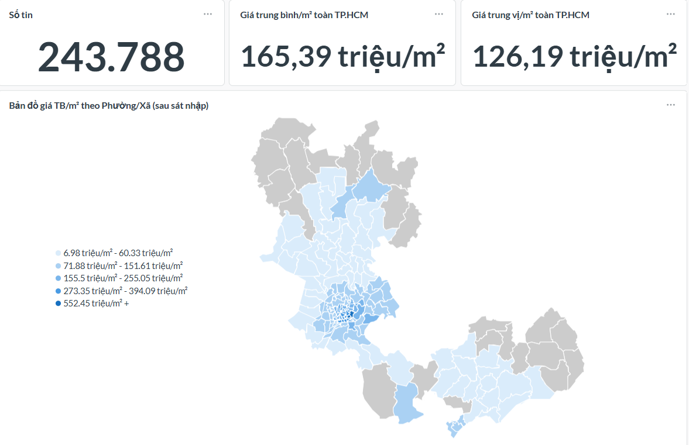
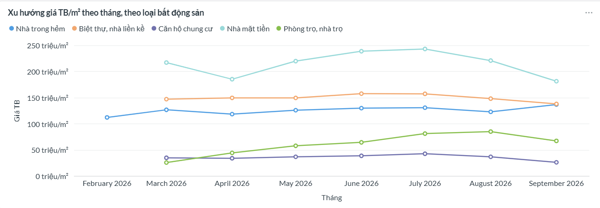
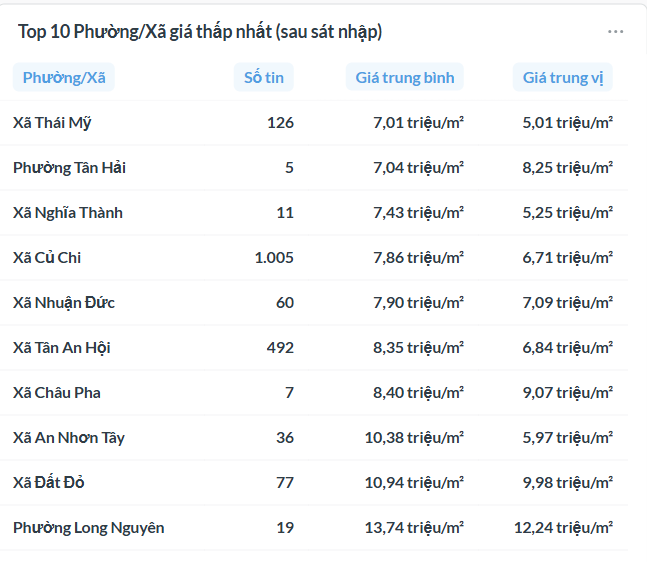
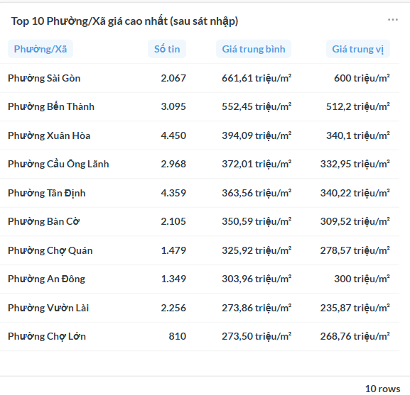
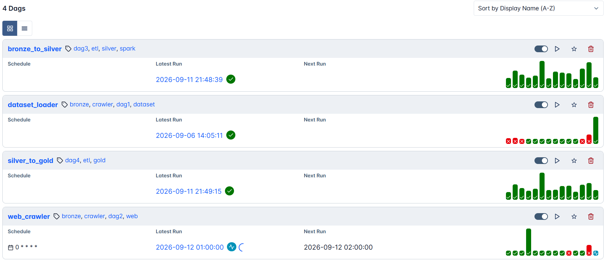
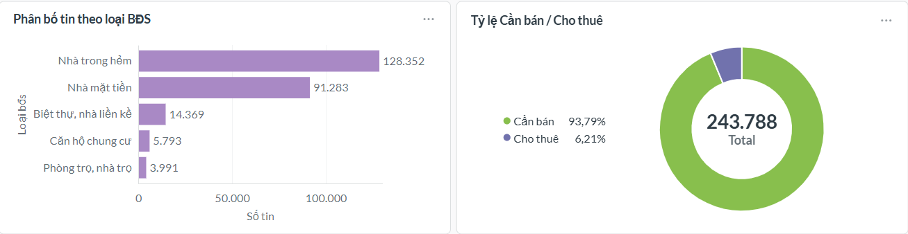
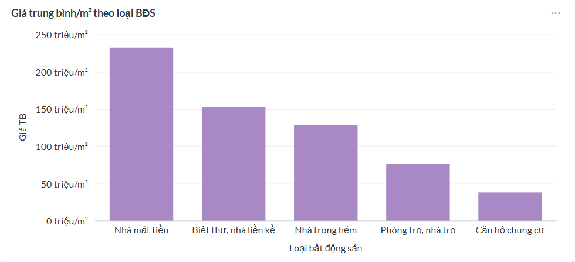

# Ho Chi Minh City Real Estate Data Warehouse

🇬🇧 English (this file) · 🇻🇳 [Tiếng Việt](README.vi.md)

[](https://www.python.org/)
[](https://airflow.apache.org/)
[](https://spark.apache.org/)
[](https://www.postgresql.org/)
[](https://aws.amazon.com/s3/)
[](https://www.docker.com/)
[](https://www.metabase.com/)

---

## Summary

This personal data engineering project turns Vietnamese real estate listing pages into an analytics-ready warehouse. It combines web crawling, PySpark parsing, SCD Type 2 history, PostgreSQL dimensional modeling, Airflow orchestration, and a Metabase dashboard.

## Demo & Key Metrics

- **243K+** in-scope listings in the latest full pipeline run
- **SCD Type 2** price history with **6,000+** listings having multiple tracked versions
- **4 Airflow DAGs** across Bronze, Silver, and Gold layers
- **3 dashboard tabs** and **13 Metabase cards** for regional, trend, and distribution analysis

The repository includes dashboard and Airflow screenshots under [`assets/`](assets/). The original bulk seed dataset is private and is not included. A small set of parquet files from the web-crawler branch is included under [`data/`](data/) for local testing.

> This project is intended for portfolio demonstration and local development. The reported metrics are from full local pipeline runs, not a production deployment.

## Table of Contents

- [Ho Chi Minh City Real Estate Data Warehouse](#ho-chi-minh-city-real-estate-data-warehouse)
  - [Summary](#summary)
  - [Demo \& Key Metrics](#demo--key-metrics)
  - [Table of Contents](#table-of-contents)
  - [Problem Statement](#problem-statement)
  - [What This Project Does](#what-this-project-does)
  - [Architecture](#architecture)
  - [Tech Stack](#tech-stack)
  - [Data Model](#data-model)
  - [Pipeline Walkthrough](#pipeline-walkthrough)
  - [Results \& Metrics](#results--metrics)
  - [Engineering Highlights](#engineering-highlights)
  - [Data Quality \& Reliability](#data-quality--reliability)
  - [Dashboard](#dashboard)
  - [Orchestration](#orchestration)
  - [Project Structure](#project-structure)
  - [Getting Started](#getting-started)
  - [Author](#author)

---

## Problem Statement

Ho Chi Minh City's real estate market lacks a transparent, aggregated view of asking prices at the ward/district level. Buyers, investors, and small brokerages currently have to manually cross-reference multiple listing sites — a slow process made worse by duplicate postings, inflated "teaser" prices, and inconsistent free-text descriptions.

This project builds a self-serve analytics layer on top of raw listing data from **alonhadat.com.vn**, turning semi-structured, Vietnamese-language HTML into clean, trend-ready price-per-m² metrics segmented by ward, district, and property type.

## What This Project Does

- **Ingests** real estate listings from two sources: a one-time bulk seed dataset and a continuous hourly web crawl.
- **Parses** messy, free-text HTML (mixed price formats, inconsistent area notation, missing fields) into structured records using Spark.
- **Tracks price history over time** with Slowly Changing Dimensions (SCD Type 2) — every price change on a listing is preserved as a new version, not overwritten.
- **Models** the cleaned data into a Kimball-style star schema optimized for analytical queries.
- **Automates** the entire pipeline end-to-end with Apache Airflow, including self-healing crash recovery.
- **Visualizes** results in a 3-tab, 13-card Metabase dashboard with interactive region maps, price trends, and distribution breakdowns.

## Architecture

The system follows a **Medallion Architecture** (Bronze → Silver → Gold), fully orchestrated by Airflow:

```
  +-------------+   +------------------+
  | Private seed |   | alonhadat.com.vn |
  | dataset     |   |                  |
  +-------------+   +------------------+
         |                    |
         v                    v
  +----------------+  +---------------------------+
  | DAG 1          |  | DAG 2                     |
  | dataset_loader |  | web_crawler               |
  | (run once)     |  | (@hourly, proxy rotation, |
  |                |  | resumable on crash)       |
  +----------------+  +---------------------------+
           |                        |
           v                        v
      +---------------------------------+
      | BRONZE - AWS S3 (raw Parquet)   |
      | schema: url | crawl_date | html |
      +---------------------------------+
                       |
                       v
     +-----------------------------------+
     | DAG 3 - bronze_to_silver          |
     | PySpark: parse HTML -> structured |
     | data, merge SCD Type 2            |
     +-----------------------------------+
                       |
                       v
  +------------------------------------------+
  | SILVER - PostgreSQL                      |
  | listing_history (SCD2), parse_quarantine |
  +------------------------------------------+
                       |
                       v
     +-----------------------------------+
     | DAG 4 - silver_to_gold            |
     | ETL SQL full-refresh idempotent   |
     | + automated validation after load |
     +-----------------------------------+
                       |
                       v
      +---------------------------------+
      | GOLD - PostgreSQL (Star Schema) |
      | 1 Fact + 5 Dim, Kimball design  |
      +---------------------------------+
                       |
                       v
             +-------------------+
             | Metabase          |
             | 3 tabs / 13 cards |
             +-------------------+
```

**Orchestration chain:** `DAG 2 (@hourly) → DAG 3 → DAG 4`, with a shared `run_id` for traceability. `DAG 1` loads the private historical seed when available and follows the same downstream chain.

## Tech Stack

| Layer | Technology | Why |
|---|---|---|
| Orchestration | **Apache Airflow 3.3.0** (CeleryExecutor) | Scheduling, retries, dependency chaining, crash-aware task tracking |
| Ingestion | **Python** (`requests`, `BeautifulSoup`) | Server-rendered HTML, no JS execution needed |
| Raw storage (Bronze) | **AWS S3** (Parquet) | Durable, low-cost storage for immutable raw data |
| Distributed processing | **PySpark 4.2.0** (local mode) | HTML parsing at scale via `mapPartitions`, mirrors real-world big-data tooling |
| Data Warehouse | **PostgreSQL 16** (self-hosted, Docker) | Silver (SCD2) + Gold (star schema) |
| BI / Dashboard | **Metabase v0.63** | Fast to stand up, good for live interview demos |
| Infrastructure | **Docker Compose** | Reproducible local orchestration of 8+ services |

**Design principle:** favor open-source / free-tier technologies over full-cloud deployment (e.g., no RDS/Redshift) to keep this a $0-cost academic project while still demonstrating cloud, distributed processing, and orchestration skills.

## Data Model

**Silver layer** — `listing_history`, an SCD Type 2 table where each row is one *observed price version* of a listing. A version is closed (`valid_to`, `is_current = FALSE`) and a new one opened whenever a change is detected in price, negotiability, expiry status, warning flag, or area — tracked via a generated `row_hash` column.

**Gold layer** — Kimball star schema, **Observation-grain** Fact table (1 fact row = 1 Silver SCD2 version, not 1 listing):



- **Trend axis:** `posted_date` (when the listing was actually posted).
- **Lineage fields:** `valid_from` / `valid_to` / `is_current` are copied from Silver for audit purposes only — never used for trend analysis.
- **Region coverage:** Ho Chi Minh City, Binh Duong, and Ba Ria–Vung Tau are unified under HCMC's post-merger administrative boundaries.

## Pipeline Walkthrough

| DAG | Purpose | Schedule | Key mechanism |
|---|---|---|---|
| **DAG 1** — `dataset_loader` | One-time load of the private historical seed dataset | Manual trigger | Dynamic task mapping, resumable via `pipeline.dataset_part_state` |
| **DAG 2** — `web_crawler` | Continuous incremental crawl of alonhadat.com.vn | `@hourly` | State-machine crawl loop with rotating proxy pool, checkpointed buffering to S3, crash-safe recovery |
| **DAG 3** — `bronze_to_silver` | Parses raw HTML into structured fields, merges into SCD2 history | Triggered by DAG 1/2 | PySpark `mapPartitions`, quarantines unparseable records instead of failing the batch |
| **DAG 4** — `silver_to_gold` | Loads the star schema and validates data integrity | Triggered by DAG 3 | Full-refresh idempotent SQL transaction + 5 automated post-load checks |

## Results & Metrics

Numbers from the latest full local pipeline run (snapshot from mid-September 2026; crawler results change as new listings are collected):

| Metric | Value |
|---|---|
| Tracked listings (current, in scope) | **~243.8K** |
| City-wide average price/m² | **165.39M VND** |
| City-wide median price/m² | **126.19M VND** |
| Listings with 2+ tracked price versions (SCD2 caught a real price change) | **6,000+** |
| Parse success rate | **100%** (zero records in `parse_quarantine` to date) |
| Avg. DAG 2 hourly run duration (no retries) | **~50 minutes** |
| Crawl throughput (1-week idle-state stress test) | **10,000+ new URLs** discovered via continuous hourly crawling |

**Property type breakdown** (in-scope listings):

| Property Type | Count | Avg. price/m² |
|---|---|---|
| Frontage house (Nhà mặt tiền) | 91,283 | ~230M VND |
| Villa / townhouse (Biệt thự, nhà liền kề) | 14,369 | ~153M VND |
| Alley house (Nhà trong hẻm) | 128,352 | ~126M VND |
| Rental room (Phòng trọ, nhà trọ) | 3,991 | ~75M VND |
| Apartment (Căn hộ chung cư) | 5,793 | ~38M VND |

**Listing type split:** 93.79% for sale (Cần bán) · 6.21% for rent (Cho thuê)

## Engineering Highlights

- **Layered and testable design:** business logic is separated from database, S3, HTTP, and Spark integrations through `*_core.py` / `*_io.py` modules and injected interfaces.
- **Resumable ingestion:** crawler state and buffered Bronze output support recovery after interrupted runs.
- **Reliable warehouse loading:** idempotent SQL, SCD Type 2 history, and transactional Gold loading make retries safe.
- **Data quality controls:** malformed records are quarantined, outliers are flagged, and automated post-load checks validate row counts, keys, and sanitized values.

## Data Quality & Reliability

- **Quarantine, don't crash:** unparseable HTML is routed to `parse_quarantine` with the original HTML and a reason — the batch keeps processing instead of failing wholesale.
- **Outlier flagging over deletion:** prices/areas outside plausible bounds are flagged (`price_is_outlier`, `area_is_outlier`) rather than silently dropped, preserving analyst visibility into anomalies.
- **Automated post-load validation:** 5 checks run after every Gold load (row-count parity with Silver, `is_current` uniqueness per listing, non-null foreign keys, outlier-flag completeness, sanitized-area bounds) — a failed check fails the Airflow task instead of silently shipping bad data.
- **Built-in diagnostics:** a dedicated diagnostic query pinpoints exactly which dimension join is dropping rows when row counts don't match, instead of guessing.

## Dashboard

Built in Metabase — 3 tabs, 13 cards, backed by a single reporting view (`gold.vw_fact_report`) so every question shares consistent filtering logic.

| Tab | Contents |
|---|---|
| **Overview** | Total tracked listings, city-wide average/median price per m², interactive region maps by ward and by district |
| **By Region** | Top 10 highest/lowest-priced wards, district-level summary table |
| **Trends & Distribution** | Monthly price trend by property type, listing volume over time, property-type distribution, sale-vs-rent split |

**Overview — total listings, avg/median price, price heatmap by ward:**



**Trends — monthly average price/m² by property type:**



**By Region — 10 cheapest wards, post-merger boundaries:**



**By Region — 10 most expensive wards:**



> The priciest ward, **Phường Sài Gòn** (former District 1), averages **~662M VND/m²** — over 4x the citywide average — while the 10 cheapest wards (mostly ex-rural districts like Củ Chi, Bến Cát) sit below 14M VND/m². That ~47x spread across a single administrative area is a good illustration of why ward-level granularity matters for this kind of analysis.

**Distribution — by property type and sale-vs-rent split:**


**Distribution — average price/m² by property type:**


## Orchestration



Airflow coordinates the four DAGs, retries failed tasks, and provides visibility into scheduled and manually triggered runs. The screenshot shows the project DAGs and their run history during local development.

## Project Structure

```
RealEstateDW/
├── assets/                 # README images (ERD diagram, dashboard + Airflow screenshots)
│   ├── erd/star_schema.png
│   ├── dashboard/*.png
│   └── airflow/dags_overview.png
│
├── crawler/                # DAG 1 (dataset) + DAG 2 (web crawler)
│   ├── config.py
│   ├── proxy_manager.py
│   ├── dataset_loader_core.py / dataset_loader_io.py
│   └── web_crawler_core.py / web_crawler_io.py
│
├── dags/                   # Airflow DAG declarations only — no business logic
│   ├── dataset_loader.py
│   ├── web_crawler.py
│   ├── bronze_to_silver.py
│   └── silver_to_gold.py
│
├── data/                   # Sample data
│
├── maps/                   # GeoJson for Metabase, base on data from gis.vn
│   ├── hcm_post_merge_wards_metabase_without_condao.geojson
│   ├── hcm_post_merge_wards_metabase.geojson
│   ├── hcm_pre_merge_districts_metabase_without_condao.geojson
│   └── hcm_pre_merge_districts_metabase.geojson
│
├── parser/                 # DAG 3 (Spark parsing) + DAG 4 (Silver -> Gold SQL)
│   ├── config.py
│   ├── bronze_to_silver_core.py / bronze_to_silver_io.py
│   ├── bronze_file_state_io.py
│   └── silver_to_gold_io.py
│
├── sql/
│   ├── schema_full.sql             # Full DDL: 3 schemas, 16 tables, 2 functions, 1 view
│   ├── dashboard_metabase_queries.sql
│   └── queries/
│       ├── merge_scd2_listing_history.sql
│       ├── etl_silver_to_gold.sql
│       ├── validate_gold_load.sql
│       └── diagnose_gold_join_loss.sql
│
├── docker-compose.yaml     # Airflow + PostgreSQL (x2) + Redis + Metabase
├── Dockerfile               # Airflow 3.3.0 + Java + JDBC driver
└── requirements.txt
```

## Getting Started

**Prerequisites:** Docker and Docker Compose. AWS credentials and an S3 bucket are required only when running the full Bronze ingestion flow; the included sample parquet files support local testing without the private seed dataset.

```bash
# 1. Clone the repo
git clone https://github.com/nhatphuong99/RealEstateDW.git
cd RealEstateDW

# 2. Configure environment
cp .env.example .env
# edit .env: Postgres credentials, Airflow secrets, and optional S3 settings

# 3. Launch the full stack
docker compose up -d

# 4. Initialize the database schema
psql -h localhost -p 5433 -U dw_admin -d real_estate_dw -f sql/schema_full.sql

# 5. Open Airflow UI at http://localhost:8080 and unpause the DAGs
# 6. Open Metabase at http://localhost:3000 and connect it to postgres-dw
```

> This is a local-development configuration (`docker-compose.yaml` is adapted from Airflow's official reference compose file). Not intended for production deployment as-is.

The private bulk seed dataset and its CDN endpoint are intentionally omitted from this repository. To reproduce the full historical load, provide equivalent parquet input and configure the dataset settings in `.env`; otherwise use the included crawler samples to validate the downstream pipeline.

`dataset_loader` is not runnable from the repository alone because its historical seed input is private. Use it only after supplying that input separately.

## Author

**Phuong Nguyen Ly Nhat**

- **GitHub:** [nhatphuong99](https://github.com/nhatphuong99)
- **Email:** [Nhatphuong NL](mailto:nlnhatphuong@gmai.com)
